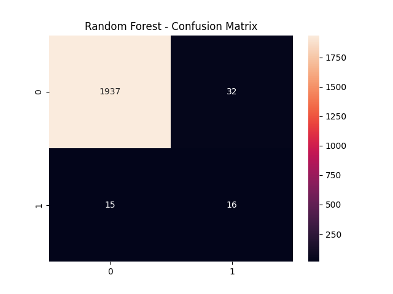
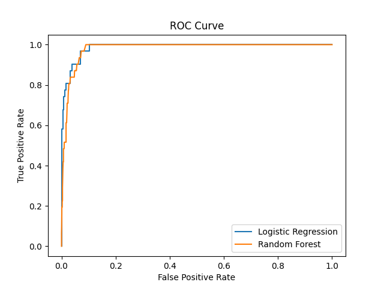
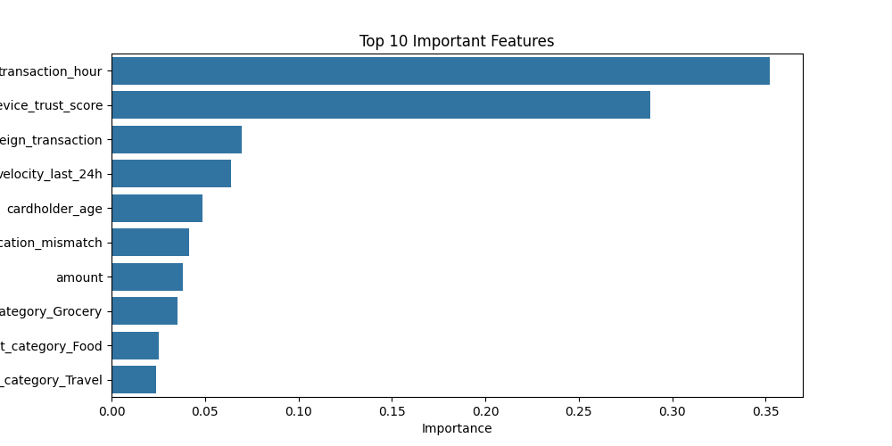

# 🚀 Fraud Detection using Machine Learning

💡 This project simulates a real-world fraud detection system used in financial institutions.

---

## 📌 Overview

This project focuses on detecting fraudulent transactions using machine learning techniques. It analyzes transaction patterns and predicts whether a transaction is fraudulent.

---

## 🎯 Objectives

* Detect fraudulent transactions
* Handle imbalanced data
* Compare ML models
* Generate fraud risk insights

---

## 📊 Dataset

The dataset contains **10,000 transactions** with features like:

* Transaction amount
* Transaction time
* Merchant category
* Foreign transaction flag
* Device trust score
* Transaction velocity
* Cardholder age

🎯 Target:

* `is_fraud` → (0 = Normal, 1 = Fraud)

⚠️ Dataset is highly imbalanced (~1.5% fraud)

---

## ⚙️ Methodology

### 🔹 Data Preprocessing

* Feature scaling
* Handling imbalance using **SMOTE**

### 🔹 Models Used

* Logistic Regression
* Random Forest

---

## 📊 Outputs

### 📌 Fraud Distribution



---

### 📌 ROC Curve



---

### 📌 Feature Importance



---

## 📈 Key Insights

* Fraud transactions are very rare
* SMOTE improves detection performance
* Random Forest performs better
* Behavioral features are important

---

## ▶️ How to Run

### 1. Install dependencies

```bash
pip install pandas numpy matplotlib seaborn scikit-learn imbalanced-learn
```

### 2. Run the project

```bash
python fraud_detection.py
```

---

## 📁 Project Structure

```
fraud-detection/
│
├── fraud_detection.py
├── fraud_distribution.png
├── ROC_Curve.png
├── feature_importance.png
├── README.md
```

---

## 🚀 Future Scope

* Real-time fraud detection system
* API integration
* Deep learning models

---

## 👨‍💻 Author

**Vignesh**
